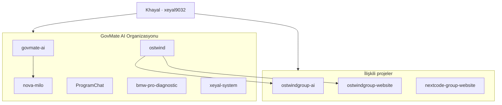

### Yapay zeka destekli dijital ürünler ve açık kaynak ekosistemi

 

---

## 🎯 Misyon

**GovMate AI**, Khayal Cemilli (*xeyal9032*) tarafından kurulan bir **ürün ve Ar-Ge organizasyonudur**. Kamu hizmetlerinden eğitime, iletişimden geliştirici araçlarına kadar — gerçek hayat problemlerine **yapay zeka ve modern yazılım** ile çözüm üretiriz.

> Tek bir uygulama değil; bağlantılı bir ürün ailesi ve açık kaynak ekosistemi.

---

## 📦 Ürün portföyü

### 🏛️ Kamu & Sivil Teknoloji

| Proje | Açıklama | Repo |
|-------|----------|------|
| **GovMate** | Almanya'daki bürokrasi süreçleri için AI asistan — belge analizi, resmi mektup | [`govmate-ai`](https://github.com/GovMateAi/govmate-ai) |

### 🤖 Yapay Zeka & Deneyim

| Proje | Açıklama | Repo |
|-------|----------|------|
| **Nova & Milo** | Sci-Fi AI giriş portalı, Gemini sohbet, Electron masaüstü | [`nova-milo`](https://github.com/GovMateAi/nova-milo) |
| **OstWind AI** | Google AI entegrasyonlu modern sohbet uygulaması | [`ostwindgroup-ai`](https://github.com/xeyal9032/ostwindgroup-ai) |
| **Xeyal System** | Otonom geliştirici OS + AI hata zekâsı platformu | [`xeyal-system`](https://github.com/GovMateAi/xeyal-system) |

### 🎓 Eğitim & Danışmanlık

| Proje | Açıklama | Repo |
|-------|----------|------|
| **OstWind Group** | Çok dilli uluslararası eğitim danışmanlığı platformu | [`ostwind`](https://github.com/GovMateAi/ostwind) |
| **OstWind Web** | Kurumsal web sitesi | [`ostwindgroup-website`](https://github.com/xeyal9032/ostwindgroup-website) |

### 💬 İletişim & Mobil

| Proje | Açıklama | Repo |
|-------|----------|------|
| **ProgramChat** | Offline-first Android mesajlaşma — E2EE, WebRTC, Socket.IO | [`ProgramChat`](https://github.com/GovMateAi/ProgramChat) |

### 🔧 Otomotiv & Donanım

| Proje | Açıklama | Repo |
|-------|----------|------|
| **BMW Pro Diagnostic** | BMW X1 E84 yerel OBD-II / UDS teşhis konsolu + Gemini AI | [`bmw-pro-diagnostic`](https://github.com/GovMateAi/bmw-pro-diagnostic) |

### 🌐 Ajans & Web

| Proje | Açıklama | Repo |
|-------|----------|------|
| **NextCode Group** | Dijital pazarlama ajansı web sitesi | [`nextcode-group-website`](https://github.com/xeyal9032/nextcode-group-website) |

---

## 🧭 Ekosistem

---

## 🛠️ Teknoloji yaklaşımı

| Alan | Tercih ettiğimiz stack |
|------|------------------------|
| **Web** | Next.js, React, TypeScript, Tailwind CSS |
| **Mobil** | Kotlin, Jetpack Compose, Android |
| **Backend** | Node.js, Supabase, PostgreSQL, Prisma |
| **AI** | Gemini, OpenAI, Google AI |
| **Gerçek zamanlı** | Socket.IO, WebRTC |
| **Masaüstü** | Electron |
| **Deploy** | Vercel, cloud-native mimari |

Kalite standartları: tip güvenliği, test otomasyonu, güvenli API tasarımı ve kullanıcı odaklı arayüz.

---

## 📊 Organizasyon istatistikleri

---

## 🤝 Katkı & iş birliği

- 🐛 Hata bildirimi ve özellik önerileri için ilgili repo'da **Issue** açın
- 🔀 Pull request'ler her projede ayrı değerlendirilir
- 📧 İş birliği: **xeyalcemilli9032@gmail.com**

---

## 🔗 Bağlantılar

| | |
|:---:|:---:|
| 🏢 **Organizasyon** | [github.com/GovMateAi](https://github.com/GovMateAi) |
| 👤 **Kurucu** | [github.com/xeyal9032](https://github.com/xeyal9032) |
| 🌐 **GovMate** | [govmate-ai.vercel.app](https://govmate-ai.vercel.app) |
| 🎓 **OstWind** | [frontend.ostwind.az](https://frontend.ostwind.az/) |

 

**GovMate AI** — Yapay zekayı herkes için erişilebilir kılıyoruz.

